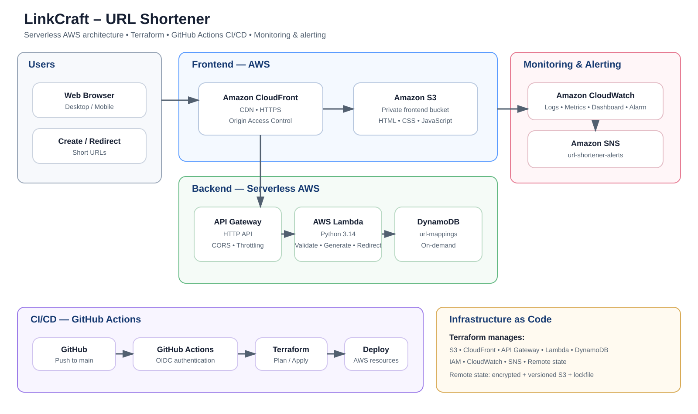

# LinkCraft – URL Shortener

A serverless URL shortener built on AWS using Terraform, GitHub Actions, and managed AWS services.

## Live Demo

https://dpcxe997lu0aa.cloudfront.net/

## Repository

https://github.com/Harsa147/aws-serverless-url-shortener

## Architecture



## AWS Services

| Service | Purpose |
|---|---|
| Amazon S3 | Private static frontend hosting |
| Amazon CloudFront | CDN and HTTPS delivery |
| Amazon API Gateway | HTTP API and request throttling |
| AWS Lambda | Serverless URL processing |
| Amazon DynamoDB | URL mapping storage |
| AWS IAM | Access control and GitHub OIDC |
| Amazon CloudWatch | Logs, metrics, dashboard, and alarms |
| Amazon SNS | Error notifications |
| Terraform | Infrastructure as Code |
| GitHub Actions | CI/CD automation |

## Features

- Create short URLs from HTTP/HTTPS URLs
- Validate submitted URLs
- HTTP 301 redirects
- Serverless backend
- Private S3 frontend behind CloudFront
- API Gateway CORS and throttling
- DynamoDB on-demand storage
- CloudWatch monitoring and SNS alerting
- Terraform-managed infrastructure
- GitHub Actions CI/CD
- GitHub OIDC authentication for AWS
- Encrypted and versioned Terraform remote state

## Request Flow

1. CloudFront serves the frontend from a private S3 bucket.
2. The frontend sends requests to API Gateway.
3. API Gateway invokes the Python Lambda function.
4. Lambda validates the URL and generates a short code.
5. DynamoDB stores the code-to-URL mapping.
6. A short-code request retrieves the mapping and returns an HTTP 301 redirect.
7. CloudWatch monitors Lambda activity and SNS receives error alerts.

## Security

- GitHub Actions uses OIDC instead of long-lived AWS access keys.
- OIDC trust is restricted to the project repository and main branch.
- The frontend S3 bucket blocks public access.
- CloudFront Origin Access Control restricts S3 object access to the project's distribution.
- Lambda DynamoDB permissions are limited to the `url-mappings` table.
- API Gateway uses route-level throttling on URL creation.
- Terraform state is stored in a private, versioned, encrypted S3 bucket with state locking enabled.
- CloudWatch monitors Lambda errors and sends SNS notifications.

## Infrastructure as Code

Terraform manages S3, CloudFront, API Gateway, Lambda, DynamoDB, IAM, CloudWatch, SNS, and the Terraform remote state configuration.

## CI/CD

```text
Git push
   ↓
GitHub Actions
   ↓
OIDC authentication
   ↓
Terraform init / fmt / validate / plan
   ↓
Terraform apply
   ↓
Lambda deployment
   ↓
API tests
   ↓
Frontend deployment to S3
   ↓
CloudFront cache invalidation